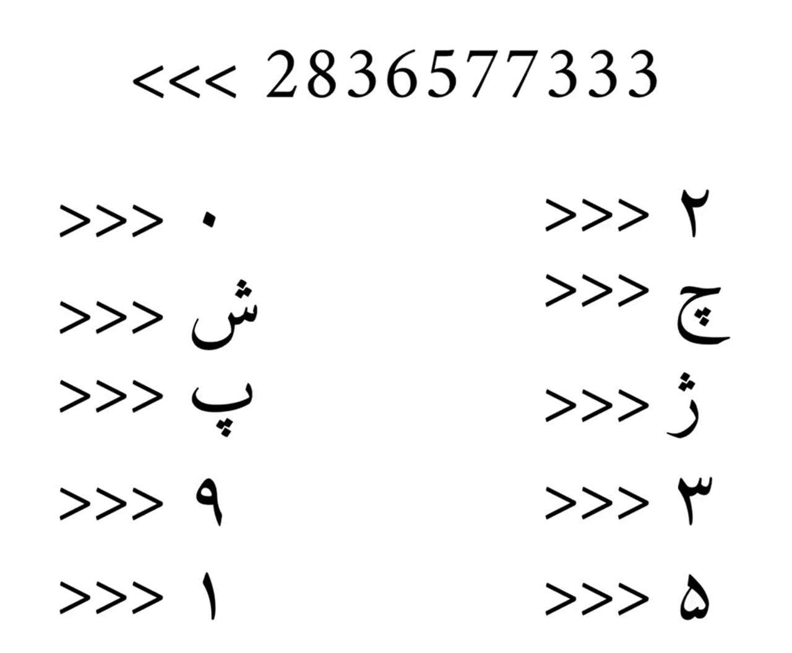
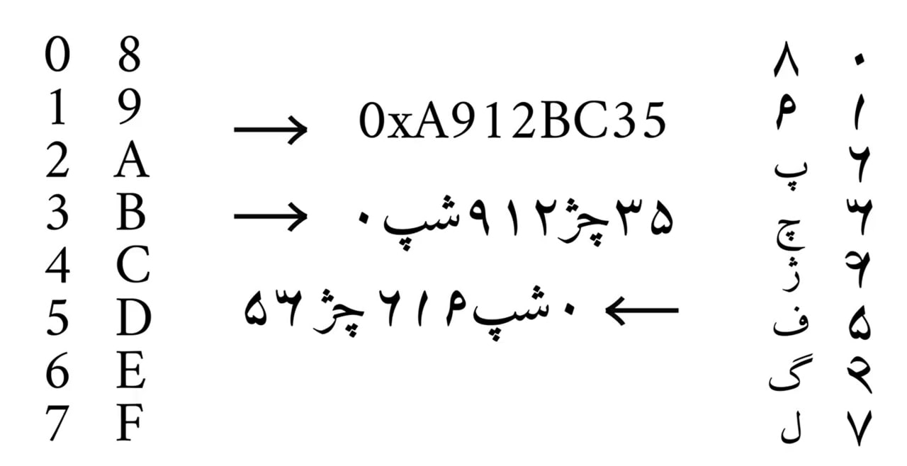

# Persian Hex System

The **Persian Hex System** is a cultural and technical project inspired by Arash Mohammadi. Its goal is to create a uniquely Persian system to replace the traditional hexadecimal (hex) numbering system, designed specifically to reflect Iranian culture and Persian language. This project provides tools and scripts in multiple programming languages to work with the Persian Hex system.

## Features

- Multilingual support with implementations in **C**, **C++**, **Python**, **PHP**, **Ruby**, and **Bash**.
- Ability to compile and run examples for Persian Hex conversion in a variety of environments.
- JSON-based input/output testing to validate implementation correctness.

## Languages

- [x] C
- [x] C++ (CPP)
- [x] Python
- [x] PHP
- [x] Go
- [x] Rust
- [x] Ruby
- [x] Bash

## Presentation Screenshots

| First                              | Second                              | Third                              |
|------------------------------------|-------------------------------------|------------------------------------|
|      |       |      |

## Installation

1. Clone the repository:
   ```bash
   git clone https://github.com/BaseMax/persian-hex-system.git
   cd persian-hex-system
   ```

2. Install the required dependencies for your environment. Ensure you have compilers (e.g., GCC, G++) and interpreters for the supported languages installed.

## Usage

### Testing All Languages

Run the test script to validate all implementations:

```bash
python3 test.py
```

### Testing a Specific Language
Specify a language to test its implementation:

```bash
python3 test.py <language>
```

For example:

```bash
python3 test.py php
```

### Example Outputs

You can compile and execute individual implementations directly. For example:

```bash
./persian_hex_c
or
./persian_hex_cpp
```

Provide an input number to convert it into the Persian Hex format.

## Examples

### Running with Python

```bash
python3 examples/repl.py
```

### Running with Ruby

```bash
ruby examples/repl.rb
```

### Running with PHP

```bash
php examples/repl.php
```

### Running with Bash

```bash
bash examples/repl.sh
```

### Compiling and Running C Code

```bash
gcc examples/repl.c libs/persian_hex.c -o persian_hex_c
./persian_hex_c
```

### Compiling and Running C++ Code

```bash
g++ examples/repl.cpp libs/persian_hex.cpp -o persian_hex_cpp
./persian_hex_cpp
```

### Testing JSON Data

Use the `data.json` file for input/output reference.

### Development

- Add your script to the `examples` directory with the appropriate file extension.
- Update `LANGUAGE_EXTENSIONS` in `test.py` if adding support for a new language.
- Follow the JSON format in `data.json` for input-output validation.

## Contributing

Contributions are welcome! Feel free to open issues or submit pull requests to improve the project.

## License

This project is licensed under the MIT License. See the [LICENSE](LICENSE) file for details.

Copyright 2025 Max Base
